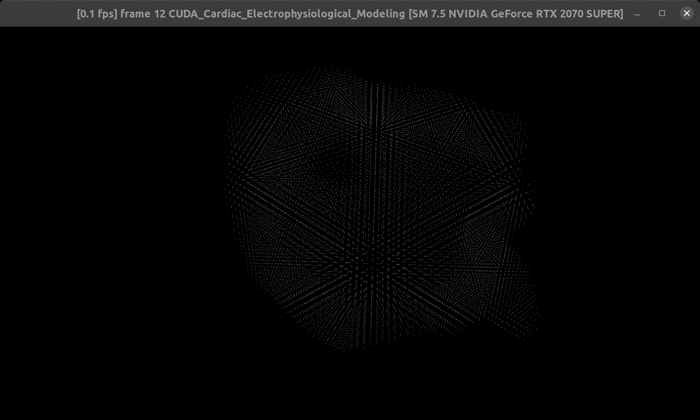
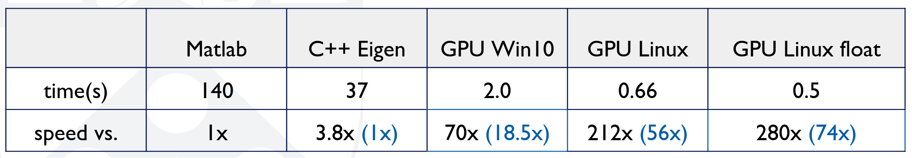

# CUDA Cardiac Electrophysiological Modeling

## Mitchell-Schaeffer Model Simulation
<p align="center">

</p>

For details about the Mitchell-Schaeffer model, please view this [paper](https://dl.acm.org/doi/abs/10.1145/3450267.3450532/).

## Check out our publication using this code
```
@article{he2022fiber,
  title={Fiber organization has little effect on electrical activation patterns during focal arrhythmias in the left atrium},
  author={He, Jiyue and Pertsov, Arkady M and Cherry, Elizabeth M and Fenton, Flavio H and Roney, Caroline H and Niederer, Steven A and Zang, Zirui and Mangharam, Rahul},
  journal={IEEE Transactions on Biomedical Engineering},
  volume={70},
  number={5},
  pages={1611--1621},
  year={2022},
  publisher={IEEE}
}
```

## Performance
Here is a performace comparison to the Matlab implementation or CPU implementation. 

The test is done with the sample input inside the data folder.
<p align="center">

</p>
* Tested on: Windows 10 and Ubuntu 20.04, AMD Ryzen 7 3700X @ 3.60GHz 32GB, RTX2070 SUPER 8GB

## Running the code
### Simulation Inputs
`data/sim_inputs.json` holds the needed parameters for the simlation. 

The attached Matlab code can be used to generate it.

`data/sim_settings.json` holds the parameters for the simulation.

### On Windows or Linux
On Windows you can also use Visual Studio to compile the code. If you want to do so, you can refer to [Setup](https://cis565-fall-2021.github.io/setup-windows/) and [Compile](https://github.com/CIS565-Fall-2021/Project0-Getting-Started/blob/main/INSTRUCTION.md).

Or you can use the dockerfile for compiling the code. Please first install docker and nvidia-docker2.
Then build the docker image by run the following line, which will compile the code inside the docker image.
```
docker build . -t cardiac
```
Run the simulation:
```
docker run cardiac --gpus 0 ./cuda_cardiac 
```
If you changed the `sim_inputs.json` or `sim_settings.json` file in the data folder. Please run the build command again to copy the files into the image.

### On NVIDIA Jetson
This repo is tested on Jetson Xaiver NX with Jetpack 4.6. Please follow this [link](https://elinux.org/Jetson/Installing_ArrayFire#GLFW) to install the GLFW on Jetson.

Then run the following in the repo folder:
```
mkdir build
cd build
cmake ..
make -j4
cp ../shaders /bin/shaders
cp ../data /bin/data
cd bin
./cuda_cardiac
```
On Jetson Xaiver NX, this code is tested with 20W4Core option.

**University of Pennsylvania, CIS 565: GPU Programming and Architecture, Final Project**

